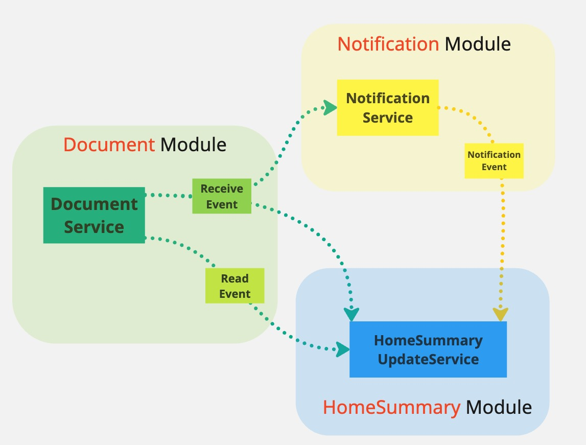
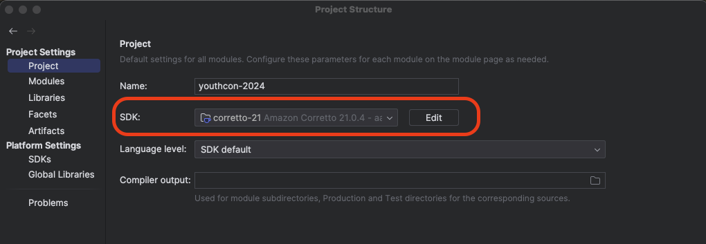
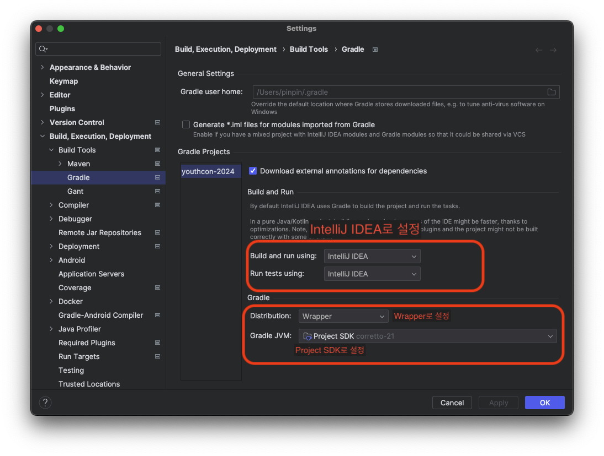
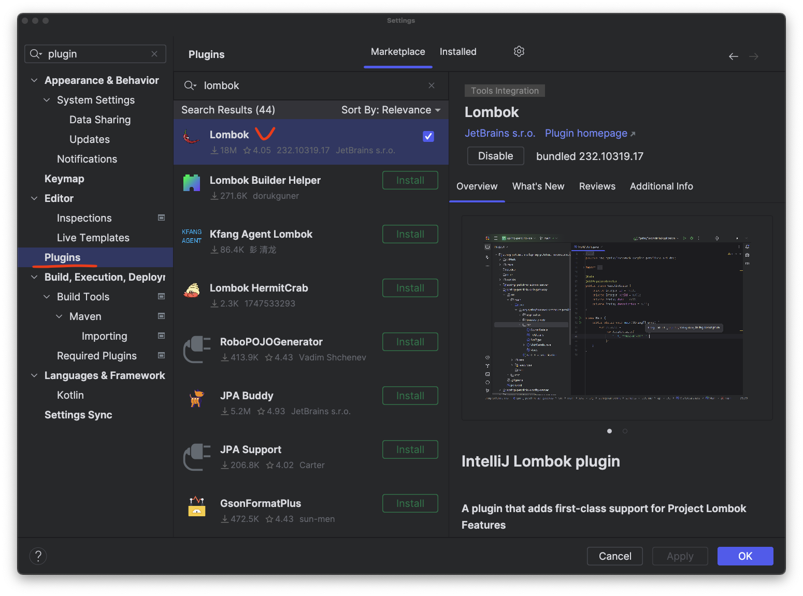

# youthcon-2024

## 안녕하세요?

안녕하세요!

`함께 해봐요 Spring Event Internal`의 진행자 박성훈입니다! 
저의 첫 발표이자 Hands-On Lab에 참석해 주셔서 감사합니다. 

함께 뜻깊은 시간을 만들기 위해서는 아래의 내용들을 읽어보시고 준비하셔야 해요!. 
번거로울 수도 있겠지만, 미리 읽고 준비해오시면 많은 도움이 될 거예요!! 

 
 

## 누구를 위한 Hands-On Lab인가요?

Event를 통한 느슨한 결합을 구현해 보고 싶으신 분이라면 모두가 들으실 수 있어요! 
**다만 주니어 개발자분들에게도 도움이 되었으면** 해서 사전 지식이 많이 필요한 Reflection 등은 사용하지 않습니다. 
때문에 어느 정도 개발 경험이 있으신 분들에겐 너무 쉬울 수도 있습니다.😁

 
 

## Hands-On Lab의 목표

1. Event 발행/구독 방식을 직접 구현하며 어떤 요소들이 필요한지 이해합니다.
2. 비동기 Event 구독을 구현하는 방법을 이해합니다.
3. DB transaction commit 이후 Event 구독을 구현하는 방법을 이해합니다.
4. `사실 해보면 별거 아니다`라는 자신감을 얻습니다.

 
 

## 프로젝트 구조 및 요구사항

우리가 함께 개발해 볼 서비스는 문서 수신 서비스입니다. 📬 
사용자들 간에 문서를 주고받을 수 있는 서비스예요! 
우리는 서비스의 많은 기능 중 `수신`과 `열람` 두 가지 Event에 대해서 다뤄봅니다. 

문서 수신 서비스에는 3가지 모듈이 존재해요. 

### Document

Event의 근간이 되는 문서 모듈이에요. 
문서를 `수신`/`열람` 할 수 있어요! 

사용자에게 문서가 수신되면 Document 객체를 만들어 저장하고 `수신`Event를 발행합니다. 
사용자가 문서를 열람하면 열람 대상 Document 객체를 열람 상태로 만들고 `열람`Event를 발행합니다.

### Home Summary

사용자의 홈 화면을 관리하는 모듈이에요. 
문서 수신 서비스의 홈 화면에는 여러 모듈의 매우 많은 것들이 한 번에 보여야 합니다. 😫 

그래서 개발자들은 홈 화면을 그릴 때마다 매번 여러 모듈에 질의를 하기보단, 
이벤트가 일어날 때마다 사용자의 문서/알림 상태 요약을 갱신 저장하여 이용하고 있어요. 

문서의 `수신`/`열람`/`알람 발송` 등의 세 가지 Event가 일어날 때마다 사용자의 요약 상태를 갱신합니다. 

단, 우리 실습에서는 중요한 부분이 아니기 때문에 간단히 로그를 찍는 것으로 갱신을 대체할거예요! 😅

### Notification

알람 발송 모듈입니다. 
문서가 `수신` 될 때, 알람을 발송합니다. 
알람 발송이 성공하면, `알람 발송`Event를 발행합니다.

이 부분 또한 실습에서는 중요한 부분이 아니기 때문에 간단히 로그만 찍을 거예요! 😉

 
 

## 이런건 알아야 해요!

- Spring bean 생성과 주입에 관한 내용을 알고 계셔야 해요!
- [CompletableFuture.runAsync(Runnable, Execute)](https://docs.oracle.com/en%2Fjava%2Fjavase%2F21%2Fdocs%2Fapi%2F%2F/java.base/java/util/concurrent/CompletableFuture.html#runAsync(java.lang.Runnable,java.util.concurrent.Executor))
  이 어떤 동작을 하는지 알아야 해요!
- [Class.isAssignableFrom(Class)](https://www.baeldung.com/java-isinstance-isassignablefrom)가 어떤 동작을 하는지 알아야 해요!

 
 

## 이런건 몰라도 돼요!

- 아직은 AsyncConfiguration.java의 내용이나 설정은 너무 신경 쓰지 마세요!
- 코드 구현 과정에서 등장할 @Lazy 사용은 너무 신경 쓰지 않으셔도 괜찮아요! (실제로는 이렇게 안 써요! 😎)
- JPA를 몰라도 실습하는데 문제없어요!

 
 

## 실습을 위한 환경 설정

### JDK21

저도 업무에서 써본 적은 없지만, 이런 기회에 열심히 써보고 싶어서 JDK21 버전을 골랐어요! 
혹시 실행 환경에 JDK21 이상 버전이 없으신가요? 
없으시다면 아래의 가이드에 따라 JDK21을 설치 및 설정해 주세요. 

#### JDK21 설치 및 설정 가이드

특별히 선호하는 공급자가 없다면 [링크](https://jdk.java.net/archive/)에서 자신의 실행 환경에 알맞은 `Open JDK 21 GA(build 21+35)`버전을 받고 압축을
풀어주세요! 
 

### Gradle

이 프로젝트는 Build를 위해 Gradle 8.8을 사용합니다. 
손쉽게 사용하실 수 있도록 Gradle Wrapper를 준비해두었어요! 

 

### Intellij 설정

우리는 테스트 코드를 실행해서 로그를 확인하는 방법으로 테스트할 거예요 
이걸 위해선 두 가지 설정을 해줘야 해요 

#### 1. 프로젝트 SDK 설정

- Project Structure 메뉴로 이동해 주세요
- Project Settings -> Project에서 SDK를 다운 받으신 JDK21로 설정해 주세요

 

#### 2. Build Tools 설정

- Setting -> Build, Execution, Deployment -> Build Tools -> Gradle로 이동해 주세요
- Build and run using, Run tests using을 IntelliJ IDEA로 변경해 주세요
- Distribution을 Wrapper로 변경해 주세요
- Gradle JVM을 Project SDK로 변경해 주세요

 

#### 3. Lombok 플러그인 확인

- Settings -> Plugins -> Marketplace 탭에서 Lombok이 설치되었는지 확인해 주세요.
- 만약 설치되지 않았다면 설치 후 재시작 해주세요!

 

#### 4. 마지막 점검

마지막 점검으로 DocumentServiceTest.java 클래스의 테스트 코드들을 실행시켜봐 주세요! 
성공하셨나요? 고생 많으셨습니다! 😁